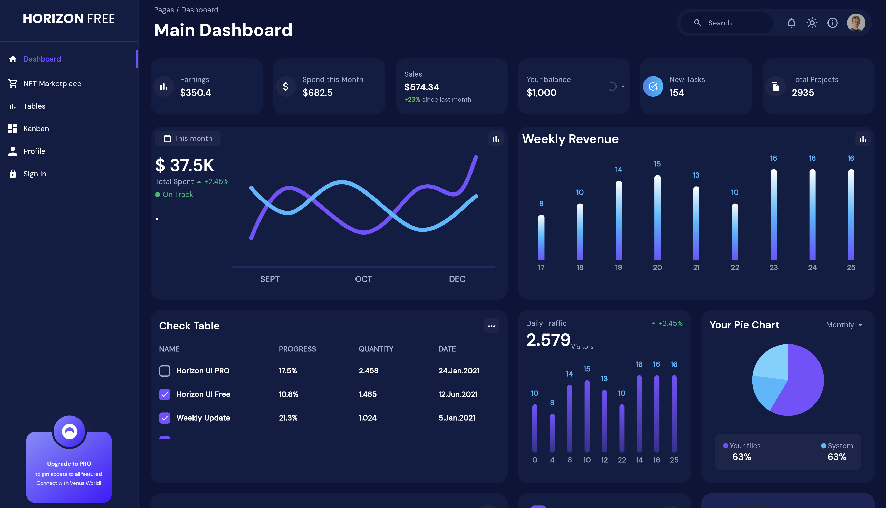
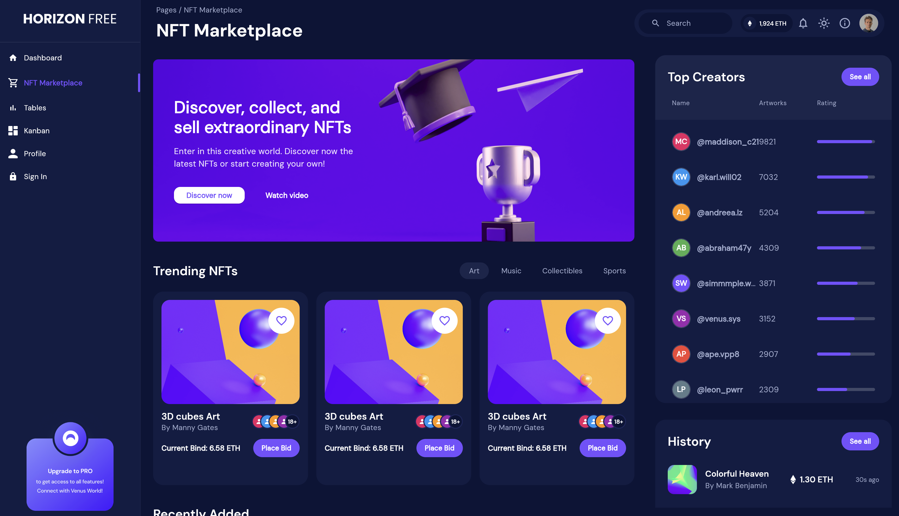
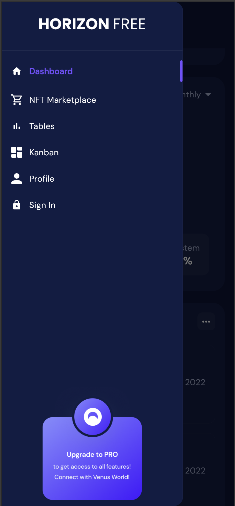
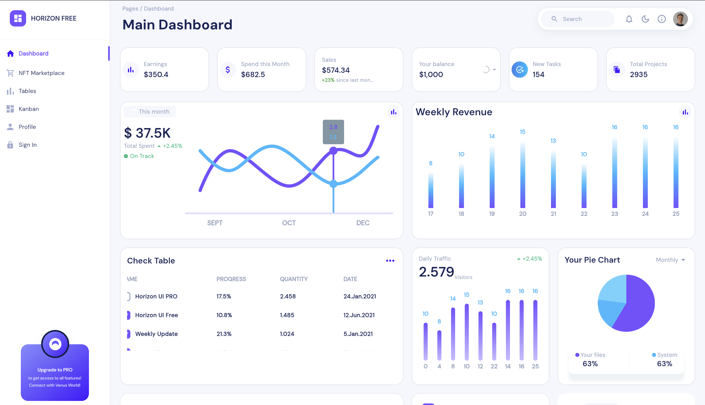

# 🎯 Horizon Dashboard

A modern, responsive dashboard application built with Flutter for web, featuring NFT marketplace interface, analytics, and professional UI components.


## ✨ Features

- **📊 Dashboard Analytics** - Real-time statistics, charts, and data visualizations
- **🎨 NFT Marketplace** - Browse trending NFTs, creator profiles, and transaction history  
- **📋 Data Tables** - Interactive tables with sorting, filtering, and progress tracking
- **🌙 Theme Support** - Dark/Light mode with smooth transitions
- **📱 Responsive Design** - Works perfectly on mobile, tablet, and desktop
- **🎯 Modern UI** - Professional components with smooth animations

## 🌐 Live Preview

**[View Live Demo →](https://nftmarketplaceui.netlify.app/)**

### Screenshots

<table>
  <tr>
    <td align="center">
      
      <br/>
      <em>Dashboard Overview</em>
    </td>
    <td align="center">
      
      <br/>
      <em>NFT Marketplace</em>
    </td>
  </tr>
  <tr>
    <td align="center">
      
      <br/>
      <em>Mobile Responsive</em>
    </td>
    <td align="center">
      
      <br/>
      <em>Light Theme</em>
    </td>
  </tr>
</table>

## 🚀 Getting Started

### Prerequisites
- Flutter SDK (3.0.0 or higher)
- Chrome browser for development

### Installation

```bash
# Clone the repository
git clone https://github.com/janWICKEDpro/nft_marketplace_ui.git

# Navigate to project directory
cd nft_marketplace_ui

# Install dependencies
flutter pub get

# Run the application
flutter run -d chrome
```

### Build for Production

```bash
flutter build web --wasm
```

## 🛠️ Built With

- **[Flutter](https://flutter.dev)** - UI framework for web
- **[Go Router](https://pub.dev/packages/go_router)** - Declarative routing
- **[Provider](https://pub.dev/packages/provider)** - State management
- **Responsive Design** - Custom breakpoint system
- **Progressive Web App** - PWA capabilities with custom loading

---

<div align="center">
  <p>Made with ❤️ using Flutter</p>
  <p>
    <a href="https://nftmarketplaceui.netlify.app/">Live Demo</a> • 
    <a href="#-features">Features</a> • 
    <a href="#-getting-started">Getting Started</a>
  </p>
</div>